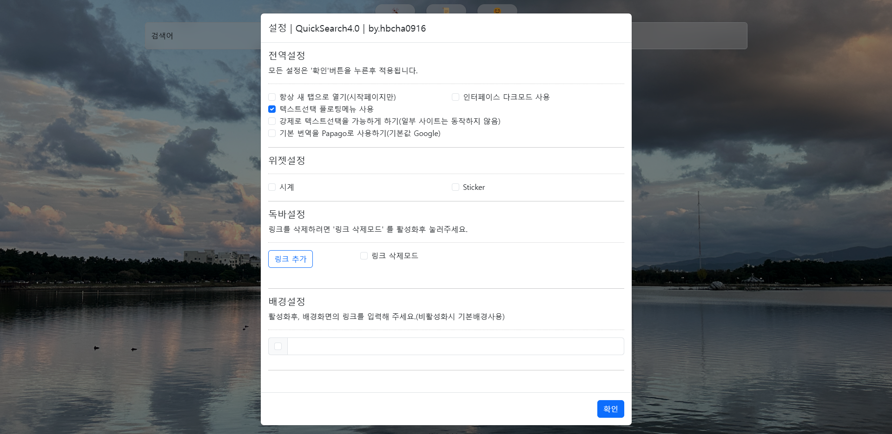
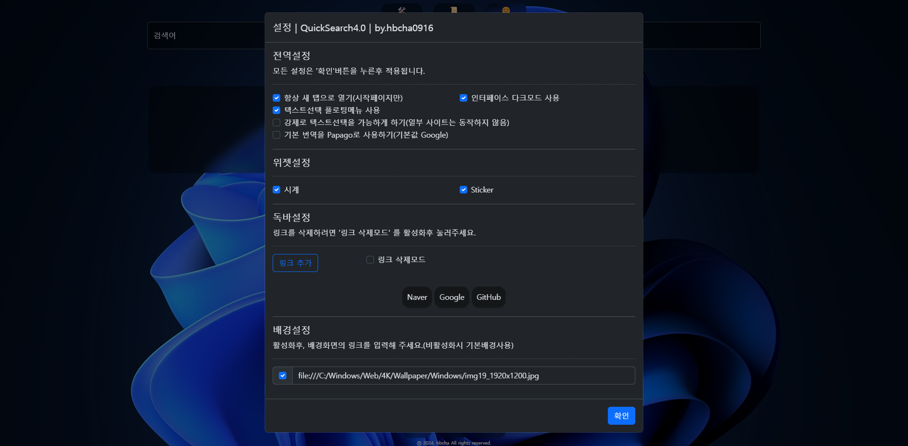
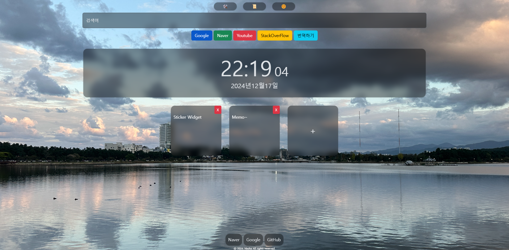
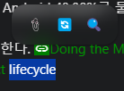

# QuickSearch4.0

QuickSearch는 본인이 개발을하면서 빠른 검색으로 개발속도를 증가시키기 위해 만든 WebApplication입니다.

습득 기술을 응용해보는것이 부 목표이기 때문에 최적화가 필요할 수 있습니다.

이번 WebApplication을 개발하면서 아래와 같은 기능들을 응용하고 습득할 수 있었습니다.

- BootStrap
- JavaScript 화살표함수사용
- ChromeExtension 개발지식

## 순서

1. 사진
2. Quicksearch?
3. QuickSearch3.0과 차이점
4. 기능상세
5. 사용 API, 프레임워크, 바로가기 링크

## 1 사진

[☝️](#순서)

## 2 QuickSearch?

개발을 하다보면 구글링(웹서핑)은 기본입니다.

하지만 구글링을 하다보면 단순하던 동작또한 아끼고 빨리하고싶습니다.(퇴근을 빨리해야 하기 때문이죠)

"빨리빨리"습관이 있던 저는 '이것또한 빠르게하고싶다'라는 생각으로 생각했던 기능들을 구현하기 위해 이 웹 애플리케이션을 제작했습니다.

1. 웹 시작페이지의 바로가기 링크
    - 크롬 기본 바로가기는 10개만 추가할 수 있습니다.(업무메일, 개발중인 웹서버, ChatGPT, StackOverFlow.. 등을 추가하면 10개는 그냥 넘습니다.)

2. 붙여놓기 동작 최소화
    - 다른 검색엔진에서 검색을 하고 싶으면 검색엔진 사이트에 들어가서 검색어를 입력해야합니다.
    만약 인터넷이 조금 느린 환경이라면? 그 검색엔진 사이트에 들어가는 시간이 소모됩니다.
    제 기준이지만, 제가 가장 자주 검색하는 검색엔진을 바로 설정할 수 있습니다.(추후 사용자정의 검색엔진을 구현할 예정입니다.)

3. 복사시 짜증나는 출처
    - 네이버 블로그, 티스토리같은 블로그의 명령어나 텍스트를 복사하면 꼭 뒤에 출처가 붙어버려 터미널에 명령어를 붙여버리면 `엔터`처리되어 원하지 않는 커맨드가 실행되는 경우가 있습니다.
    - 텍스트를 드래그선택하면 자동으로 팝업이 나와 📎버튼을 눌러 복사하면 출처는 복사되지 않습니다.

4. 드래그를 허용하지 않는 개발 블로그
    - 텍스트를 복사하고싶은 블로그내용에 드래그를 할 수 없어 드래그를 해제하는 기능을 넣었지만, 일부 사이트만 동작합니다.

웹 개발에 능숙하지 못하지만 적어도 `QuickSearch3.0`사용할때부터는 실제로 제 개발업무속도가 조금은 빨라졌습니다.

[☝️](#순서)

## 3 QuickSearch3.0과 차이점

|  | QS3.0 | QS4.0 |
|--|--|--|
|방식|WebPage|ChromeExtension(Web)|
|위젯지원|시계 고정|시계,Sticker를 키고 끌 수 있음|
|부가 편의기능| - |웹페이지에서 텍스트를 드래그시 빠르게 복사,검색,번역 가능|
|사용자정의옵션|다크모드,배경화면,DockURL|다크모드,배경화면,DockURL,기본번역(Google,NaverPapago)설정,위젯 등|

[☝️](#순서)

## 4 기능상세

### 플로팅메뉴

텍스트를 드래그하면 📎🔁🔍 아이콘이 등장합니다

> 설정에서 '텍스트선택 플로팅메뉴 사용' 옵션을 켜야 동작합니다.

> 일부 드레그가 금지된 사이트에서 '강제로 텍스트선택을 가능하게 하기'옵션을 켜면 드레그가 가능합니다.(모든 사이트가 가능하진 않습니다.)

|아이콘|기능|
|--|--|
|📎|-클립보드로 복사합니다 -일부 사이트에서 복사시 복사한 텍스트 다음줄에 '출처'가 붙지 않습니다.(터미널에 붙여넣을때 짜증 유발을 방지할 수 있습니다.)|
|🔁|-선택한 택스트를 번역합니다. -옵션에서 '기본 번역을 Papago로 사용하기'옵션을 켜면 `Naver Papago` 번역 페이지로 이동합니다.|
|🔍|-선택한 텍스트를 사용자가 선택한 검색엔진으로 검색합니다. -'Google, Naver, Youtube, StackOverFlow, 번역하기'중 선택했던 검색엔진으로 검색합니다.

[☝️](#순서)

### 3개국어 지원

이 확장 프로그램은 한국어, 영어, 일본어를 지원합니다.

하지만 READEME에 일본어가 없습니다.

번역은 `ChatGPT`가 했습니다.

[☝️](#순서)

### 빠른 검색

구글 확장프로그램의 새 탭 페이지는 최초 포커스를 주소창을 기본으로 하는것이 원칙이기 때문에 `QuickSearch3.0`에서 '허공에 붙여놓기시 바로검색'기능이 삭제되었습니다.

'새 탭'에서 붙여놓기후 바로 엔터키를 누르면 크롬 주소창의 기본검색엔진으로 검색됩니다.

다른 검색엔진에 검색하려면 검색창을 클릭후 붙여놓은후 엔터를 누르면 검색됩니다.

[☝️](#순서)

### 위젯

새 탭 페이지에서 시계와 Sticker를 키고 끌 수 있습니다.

#### Sticker

Sticker는 `StickerBox`에 간단한 메모를할 수 있습니다.

빨간색`X`버튼을 누르면 `StickerBox`를 삭제할 수 있습니다.

[☝️](#순서)

## 5 사용 API, 프레임워크, 바로가기 링크

### API

- suggestqueries.google.com
- Chrome Extension API

### 프레임워크/라이브러리

- jQuery v3.7.1
- Bootstrap v5.3.3

### 사용된 바로가기 링크

- Google: `https://www.google.com/search?q={USER_TEXT}`,
- Naver: `https://search.naver.com/search.naver?where=nexearch&sm=top_hty&fbm=0&ie=utf8&query={USER_TEXT}`,
- Youtube: `https://www.youtube.com/results?search_query={USER_TEXT}`,
- StackOverflow: `https://stackoverflow.com/search?q={USER_TEXT}`,
- GoogleTranslate: `https://translate.google.co.kr/?sl=auto&tl=${UILanguage}&text=${USER_TEXT}&op=translate`
- NaverPapago: `https://papago.naver.com/?sk=auto&tk=${UILanguage}&hn=0&st=${USER_TEXT}`

[☝️](#순서)